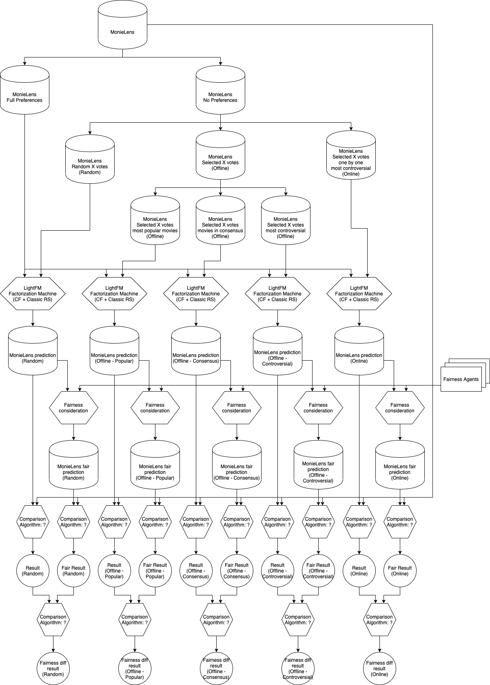

# fair-factorization-machines-recommendation-comparison

This repository holds the code and additional artifacts for a thesis that will compare multiple methods of recommendation.

## High level diagram

## Required packages

- pandas
- lightfm

> [!NOTE]  
> Can be installed using pip

## Important links

[MovieLens 1M Dataset](https://grouplens.org/datasets/movielens/1m/)

[LightFM Dataset](https://making.lyst.com/lightfm/docs/lightfm.data.html)

[LightFM Dataset example](https://making.lyst.com/lightfm/docs/examples/dataset.html)
